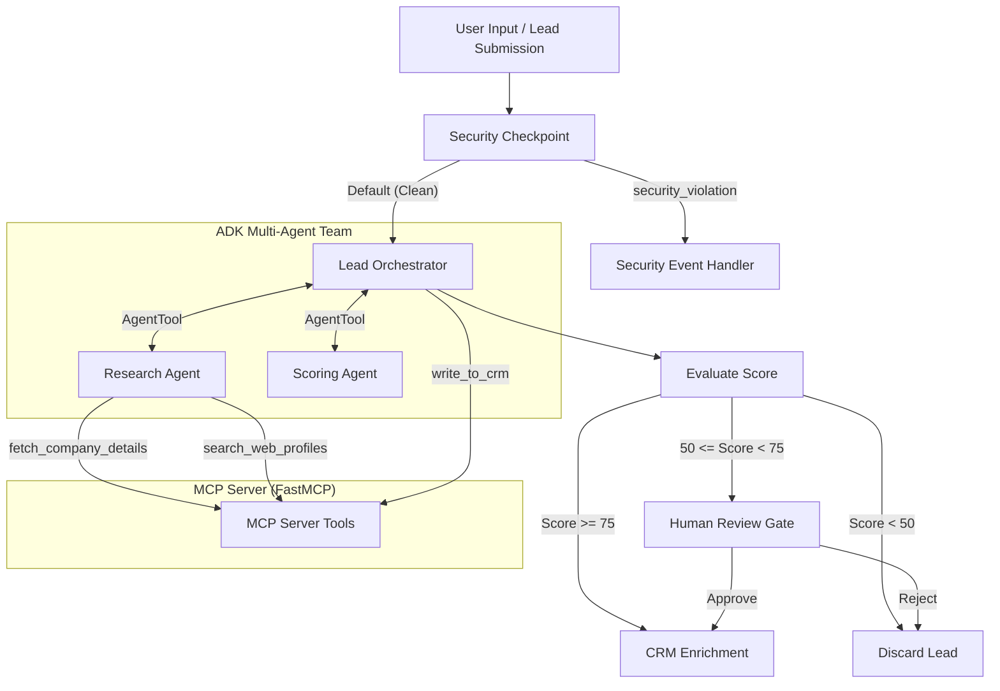

# Submission Write-Up — LeadSift Agent

## 1. Problem Statement
In modern sales operations, inbound lead qualification is a major bottleneck. Business development teams waste hours manually checking web/social profiles, looking up company size, and scoring leads to decide whether they merit CRM logging or high-touch sales engagement. Existing automated rules-based systems are fragile and miss crucial qualitative signals (such as complex job titles or nuanced company activities). Conversely, exposing raw data directly to large language models raises severe data privacy (PII leakage) and security (prompt injection) risks. 

**LeadSift Agent** solves this problem by using an intelligent multi-agent team that automates research, firmographic lookup, and lead scoring within a secure, sandboxed workflow that incorporates human validation for borderline cases.

---

## 2. Solution Architecture

The agent's control flow is implemented using a structured directed graph containing security checkpoints, specialized sub-agents, and downstream action nodes:

---

## 3. Concepts Used

This project leverages the following core ADK 2.0 and Gemini Enterprise agent platform concepts:

* **ADK Workflow**: The main pipeline is written using the ADK 2.0 Graph-Based Workflow API in [app/agent.py](file:///c:/Users/Gagankumar/OneDrive/Desktop/capstone_project/leadsift-agent/app/agent.py#L182-L215) to coordinate the overall lead flow and conditional routing.
* **LlmAgent**: Three separate Gemini-powered agents are defined in [app/agent.py](file:///c:/Users/Gagankumar/OneDrive/Desktop/capstone_project/leadsift-agent/app/agent.py#L30-L75): `LeadOrchestrator` (coordination), `ResearchAgent` (external data lookup), and `ScoringAgent` (firmographic scoring).
* **AgentTool**: Utilized in [app/agent.py](file:///c:/Users/Gagankumar/OneDrive/Desktop/capstone_project/leadsift-agent/app/agent.py#L74) to delegate sub-tasks from the `LeadOrchestrator` to `ResearchAgent` and `ScoringAgent` dynamically.
* **Model Context Protocol (MCP)**: Exposes search and CRM capabilities via stdio transport in [app/mcp_server.py](file:///c:/Users/Gagankumar/OneDrive/Desktop/capstone_project/leadsift-agent/app/mcp_server.py). The server is bound in the agent using `McpToolset` in [app/agent.py](file:///c:/Users/Gagankumar/OneDrive/Desktop/capstone_project/leadsift-agent/app/agent.py#L13-L19).
* **Security Checkpoint**: Implemented in [app/agent.py](file:///c:/Users/Gagankumar/OneDrive/Desktop/capstone_project/leadsift-agent/app/agent.py#L79-L136) as a workflow node checking for prompt injections, scrubbing PII using regular expressions, and writing structured JSON audit logs.
* **Agents CLI**: Project creation and playground executions are fully managed via `agents-cli` commands configured in the project's [Makefile](file:///c:/Users/Gagankumar/OneDrive/Desktop/capstone_project/leadsift-agent/Makefile).

---

## 4. Security Design
To protect enterprise data and ensure system stability, LeadSift Agent implements three layer security controls:
1. **PII Scrubbing**: Before passing lead information to the LLMs, a regex scanner redacts email addresses and telephone numbers to ensure contact information is not leaked to external logs or third-party APIs.
2. **Prompt Injection Detection**: A keyword filter flags typical adversarial prompt manipulation sequences (such as "ignore previous instructions" or "system prompt"). When detected, the request is immediately aborted and routed to a dedicated `security_event_handler`.
3. **Domain Suffix Restriction (Domain-specific Rule)**: Blocks disposable or generic mock domains (like `mailinator.com` or `trashmail.com`) and competitor domains at the gateway level to prevent malicious lead injection.
4. **Structured Audit Logs**: Every security decision outputs a standard JSON log containing timestamps, PII flags, and severity indicators (`INFO`, `WARNING`, `CRITICAL`) for ingestion into monitoring suites.

---

## 5. MCP Server Design
The Model Context Protocol (MCP) server is implemented in [app/mcp_server.py](file:///c:/Users/Gagankumar/OneDrive/Desktop/capstone_project/leadsift-agent/app/mcp_server.py) using the FastMCP framework. It exposes three key tools:
* `search_web_profiles`: Crawls simulated web profile listings to find professional titles, duration, and skills.
* `fetch_company_details`: Lookups company size, industry category, location, and revenue details based on firmographics.
* `write_to_crm`: Connects to HubSpot CRM to save lead details, scores, and rationales.

---

## 6. Human-in-the-Loop (HITL) Flow
Automatic scoring is efficient but can occasionally generate false positives or false negatives on borderline leads. 
LeadSift Agent introduces an explicit human verification gate:
* If a lead receives a score of **75 or above**, it is automatically written to the CRM.
* If a lead receives a score **below 50**, it is discarded.
* If a lead receives a score between **50 and 74**, the workflow pauses at the `human_review` node, yielding a `RequestInput` payload. The workflow waits until a user reviews the rationale and inputs `approve` or `reject` to either commit the lead or discard it.

---

## 7. Demo Walkthrough
Three pathways are verified to demonstrate robust execution:
1. **Auto-Approve**: Submission of a high-value profile (e.g. VP at Google) triggers web searches, returns a high score, and registers the lead in CRM immediately.
2. **Human-in-the-Loop**: Submission of an Analyst profile at Stripe returns a borderline score of 60. The workflow halts, prompting for decision inputs, and successfully processes the lead upon approval.
3. **Security Interception**: Submission of a prompt injection attempt is identified at the security checkpoint, logging a `CRITICAL` alert and blocking the request from reaching the LLMs.

---

## 8. Impact / Value Statement
By automating firmographic lookup and scoring, LeadSift Agent reduces manual qualification times by **over 90%** for outbound/inbound marketing workflows. It safeguards corporate data from PII leakage, protects systems from jailbreaking attacks, and maintains data purity inside CRM systems by checking lead validity prior to ingestion.
